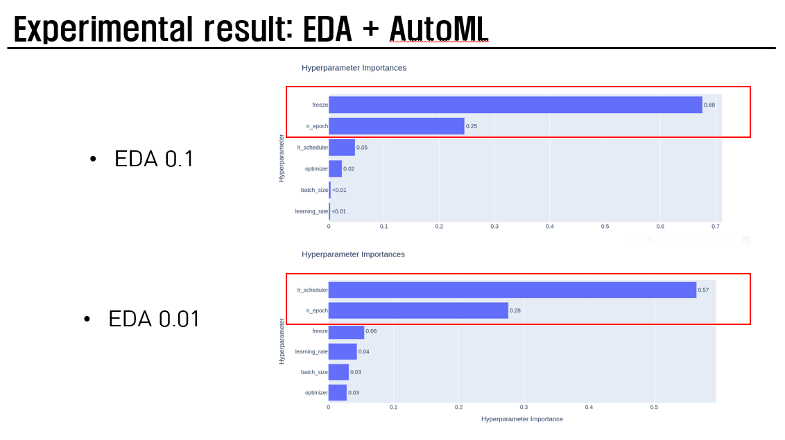
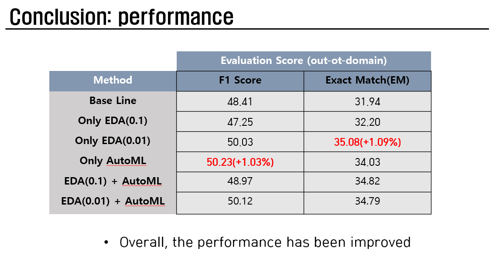

# Robust-QA using DistilBERT
- BERT 의 경량화 version = DistilBERT
- In-domain dataset(SQuAD, NewsQA, Natural Questions) 에 대해서 학습하고 한 번도 보지 못한 Out-domain dataset(DuoRC, RACE, RelationExtraction) 에 대해서 robust 한 question answering model 을 구축하는 것이 본 프로젝트의 목표이다. 

<a href='https://github.com/michiyasunaga/robustqa'> Dataset & Code in Reference github</a>

### Code Analysis
- train.py
    - function
        - prepare_eval_data(dataset_dict, tokenizer)
        - prepare_train_data(dataset_dict, tokenizer)
        - read_and_process(args, tokenizer, dataset_dict, dir_name, dataset_name, split)
        - get_dataset(args, datasets, data_dir, tokenizer, split_name)
        - main
    - class
        - Trainer()
            - __init__
            - train
            - evaluate
            - train
    - **Process**
        1. Pre-trained DistilBert & pre-trained DistileBertTokenizerFast 를 불러온다.
        2. Fine-tuning: get_dataset(train, val[in-domain]) -> trainer.train
            ```
            python train.py --do-train --eval-every 2000 --run-name baseline-01
            ```
        3. Eval: 내가 학습시킨 경로(ckpt)에서 model 가져와서, get_dataset(eval[out-domain])
            ```
            python train.py --do-eval --sub-file mtl_submission_val.csv --save-dir save/baseline-01 --eval-dir datasets/oodomain_val
            ```
        4. Test: score 는 안 나오고 prediciton answer 만 출력가능.
            ```
            python train.py --do-eval --sub-file mtl_submission_val.csv --save-dir save/baseline-01
            ```
        - 본 프로젝트에서는 Fine-tuning & Eval 을 사용

- EDA/eda_nlp/code
    - eda.py: easy data augmentation fucntion
        - get-only-chars 를 안하도록 수정했다. 필요한 text 도 자르기 때문에 원본 그대로 나갈 수 있게 조정했다.
    - augment.py: 실제로 augmentation 을 하는 파일
    - 아래의 명령어를 실행하면 같은 경로에 있는 squad(txt file) 을 불러와서 모든 format 은 동일하게 맞추고 context 를 augmentation 한 뒤에, 그에 따라 answer_start 를 python 의 str.index(str) 을 이용하여 맞춰준다.
        - 즉, 원본에서 바뀌는 값은 context 와 answer_start 라고 할 수 있다.
    - 이때, 모든 alpha 값들은 0.1 이 default 이다. 
    - 순서대로 synonyms, delete, insertion, swap
    ```
    python augment.py --input=squad --num_aug=1 --alpha_sr=0.1 --alpha_rd=0.1 --alpha_ri=0.1 --alpha_rs=0.1
    ```
    - EDA 기법은 classification 용도로 나왔기 때문에 hyperparamter 조정을 잘해야 된다. 또한, answer text 부분이 바뀌는 augmentation 은 알아서 걸러지도록 코드를 수정했다.
        - 즉, 정답은 고정이고 나머지 부분이 augmentation 되는 것이다. 
    - reference: <a href='https://github.com/jasonwei20/eda_nlp'>reference github</a>

- DistilBertForQuestionAnswering 의 output 은 다음과 같다.
```
outputs = model(input_ids, attention_mask=attention_mask, start_positions=start_positions, end_positions=end_positions)
loss, start_logits, end_logits = outputs
print("Loss:", loss)
print("Start Logits:", start_logits)
print("End Logits:", end_logits)
```

- custom_train.py: experiment $1$ version, only AutoML
    - ./save/test-01~-05 폴더가 만들어지고, 그 폴더 안에 train_mtl_submission_val.csv & validation_mtl_submission_val.csv, etc. 가 만들어진다.
    - n_trials = $5$ 로 설정하면 $5$ 번의 실험을 한다는 얘기인데, test-01 의 log_train.txt & log_validation.txt 에 test-$01~-05$ 의 정보가 다 담겨있다. 
    ```
    python custom_train.py --eval-every 5000 --run-name test --sub-file mtl_submission_val.csv  --eval-dir datasets/oodomain_val
    ```

- custom_train2.py: experiment $2$ version, only AutoML
    - ./save/test2-01~05 폴더가 만들어지고, 그 폴더 안에 train_mtl_submission_val.csv & validation_mtl_submission_val.csv, etc. 가 만들어진다.
    - n_trials = $5$ 로 설정하면 $5$ 번의 실험을 한다는 얘기인데, test2-01 의 log_train.txt & log_validation.txt 에 test2-01~-05 의 정보가 다 담겨있다. 
    ```
    python custom_train2.py --eval-every 5000 --run-name test2 --sub-file mtl_submission_val.csv  --eval-dir datasets/oodomain_val
    ```

- custom_train3.py: experiment $3$ version, only EDA
    - ./save/test3-01~05 폴더가 만들어지고, 그 폴더 안에 train_mtl_submission_val.csv & validation_mtl_submission_val.csv, etc. 가 만들어진다.
    - EDA 기법을 통해 증강된 $3$ 개의 dataset 을 train 에 활용.
    - EDA 기법을 활용했을 때의 성능 측정을 위한 python code.  
    ```
    python custom_train3.py --eval-every 5000 --run-name test3 --sub-file mtl_submission_val.csv  --eval-dir datasets/oodomain_val --train-datasets squad,nat_questions,newsqa,eda_squad,eda_nat_questions,eda_newsqa
    ```

- custom_train_final.py: experiment $5$ version, EDA + AutoML
    - ./save/final-01~100 폴더가 만들어지고, 그 폴더 안에 train_mtl_submission_val.csv & validation_mtl_submission_val.csv, etc. 가 만들어진다.
    - EDA 기법을 통해 증강된(experiment $3$) $3$ 개의 dataset 을 train 에 활용.  
    ```
    python custom_train_final.py --eval-every 5000 --run-name final --sub-file mtl_submission_val.csv  --eval-dir datasets/oodomain_val --train-datasets squad,nat_questions,newsqa,eda_squad,eda_nat_questions,eda_newsqa
    ```
- make_plot.ipynb: AutoML 로 학습한 결과를 읽어서 다양한 figure 로 분석할 수 있다.

## Dataset
- **Train dataset**: $242304$, In-domain dataset(SQuAD, NewsQA, Natural Questions)
- **Validation dataset**: $38888$, In-domain dataset(SQuAD, NewsQA, Natural Questions)
- **Evaludation dataset**: $721$, Out-domain dataset(DuoRC, RACE, RelationExtraction)

## Baseline
- batch_size: $16$
- lr: $3e-05$
- num_epochs: $3$
- seed: $42$
- optimizer: AdamW
- lr_scheduler : None
- train: squad, nat_questions, newsqa 
- val: squad, nat_questions, newsqa
- eval_datasets: race, relation_extraction, duorc

- **val score: $70.83$(F1), $54.92$(EM)**
- **eval score: $48.41$(F1), $31.94$(EM)**

## Proposed Method
1. Data Augmentation
    - EDA(Easy Data Augmentation) 기법을 사용하여 데이터 증강을 한다.
    - EDA 기법은 classification task 에 대해서 증강하기 위해 나온 기법이지만, QA task 에 맞춰서 일부 변형했다.
        - 대소문자 그대로
        - 정답은 그대로, 정답을 제외한 나머지 단어를 바꿀 수 있게
    ```
    python augment.py --input=squad --num_aug=1 --alpha_sr=0.01 --alpha_rd=0.01 --alpha_ri=0.01 --alpha_rs=0.01
    python augment.py --input=newsqa --num_aug=1 --alpha_sr=0.01 --alpha_rd=0.01 --alpha_ri=0.01 --alpha_rs=0.01
    python augment.py --input=nat_questions --num_aug=1 --alpha_sr=0.01 --alpha_rd=0.01 --alpha_ri=0.01 --alpha_rs=0.01
    ```
2. AutoML for hyperparameter

*** 

*모든 실험에서 seed 값은 동일하다*

*모든 실험에서 F1 score 를 기준으로 가장 성능이 좋았던 model ckpt 로 evaluation 을 진행한다*

## 1th experiment
- Baseline 은 정했으니, proposed method 의 일부(only AutoML)를 실험해봤다. $Trial = 5$
- AutoML 의 hyperparameter 로는 lr, optimizer, batch size, epoch 가 있다.
    1. lr:  $2e-5 ~ 2e-4$
    2. optimizer: SGD, Adam, AdamW
    3. batch size: $16, 32, 64$
    4. epoch: $2 - 5$
- **Val score: $71.23$(F1), $54.87$(EM) 이 max($trial=3$)**
- **Eval score: $48.94$(F1), $33.25$(EM) / $48.28$(F1), $33.77$(EM) 이 max($trial=2, 4$)**

```
    python custom_train.py --eval-every 5000 --run-name test --sub-file mtl_submission_val.csv  --eval-dir datasets/oodomain_val
```

- 이 실험을 통해 알 수 있었던 건
    1. SGD optimizer 를 쓴 실험 결과는 전부 최저점이다. (max 의 반절 정도)
    2. Adam, AdamW 는 일반적으로 잘 작동한다. 
    3. Val score 가 가장 좋았던 건 trial 3 였는데 Eval score 가 가장 좋았던 건 $trial 2, 4$ 였다. 

## 2th experiment
- 실험 결과가 저조했던 SGD optimizer 는 뻈다. (experiment only AutoML)
- $Trial = 10$
- hyperparameter
    1. learning rate: $2e-5 ~ 2e-4$
    2. optimizer: Adam, AdamW, RMSprop
    3. batch size: $16, 32, 64$
    4. epoch: $2~5$
    5. freeze: fine-tuning vs transfer learning(last layer/last transformer layer) for classification layer
    6. lr_scheduler: lambda, multiplicative, step, cosineannealing, no

```
    python custom_train2.py --eval-every 5000 --run-name test2 --sub-file mtl_submission_val.csv  --eval-dir datasets/oodomain_val
```

- **Val score: $71.51$(F1), $55.69$(EM) 이 max($trial=3$)**
- **Eval score: $50.23$(F1), $34.03$(EM) 이 max($trial=3$)**

## 3th experiment
- EDA 기법을 baseline 에 추가했을 때의, 성능 측정
    ```
    python custom_train3.py --eval-every 5000 --run-name test3 --sub-file mtl_submission_val.csv  --eval-dir datasets/oodomain_val --train-datasets squad,nat_questions,newsqa,eda_squad,eda_nat_questions,eda_newsqa
    ```
- Augmentation rate: $0.01$ 로 하고 실험한 결과이다.
    ```
    python augment.py --input=[file] --num_aug=1 --alpha_sr=0.01 --alpha_rd=0.01 --alpha_ri=0.01 --alpha_rs=0.01
    ```

- **Train dataset**: $473866$, In-domain dataset(SQuAD, NewsQA, Natural Questions)
- **val score: $70.23$(F1), $53.97$(EM)**
- **eval score: $50.03$(F1), $35.08$(EM)**

## 4th experiment
- EDA 기법을 baseline 에 추가했을 때의, 성능 측정
    ```
    python custom_train3.py --eval-every 5000 --run-name experiment4 --sub-file mtl_submission_val.csv  --eval-dir datasets/oodomain_val --train-datasets squad,nat_questions,newsqa,eda_squad,eda_nat_questions,eda_newsqa
    ```
- Augmentation rate: $0.1$ 로 하고 실험한 결과이다.
    ```
    python augment.py --input=[file] --num_aug=1 --alpha_sr=0.1 --alpha_rd=0.1 --alpha_ri=0.1 --alpha_rs=0.1
    ```

- **Train dataset**: $418137$, In-domain dataset(SQuAD, NewsQA, Natural Questions)
- **val score: $69.95$(F1), $53.85$(EM)**
- **eval score: $47.25$(F1), $32.20$(EM)**

## 5th experiment
- EDA 기법을 baseline 에 추가했을 때의, 성능 측정
    ```
    python custom_train3.py --eval-every 5000 --run-name experiment5 --sub-file mtl_submission_val.csv  --eval-dir datasets/oodomain_val --train-datasets squad,nat_questions,newsqa,eda_squad,eda_nat_questions,eda_newsqa
    ```
- Augmentation rate: rd, rs 만 $0.1$ 로 하고 실험한 결과이다.
    ```
    python augment.py --input=[file] --num_aug=1 --alpha_sr=0.0 --alpha_rd=0.1 --alpha_ri=0.0 --alpha_rs=0.1
    ```

- **Train dataset**: $404214$, In-domain dataset(SQuAD, NewsQA, Natural Questions)
- **val score: $70.13$(F1), $53.65$(EM)**
- **eval score: $47.51$(F1), $31.68$(EM)**

## 6th experiment
- EDA 기법을 통해 증강된(experiment $4$) $3$ 개의 dataset 을 train 에 활용.  
- $Trial=30$
- **Train dataset**: $418137$, In-domain dataset(SQuAD, NewsQA, Natural Questions)
- **val score: $70.48$(F1), $54.32$(EM)**
- **eval score: $48.66$(F1), $33.77$(EM)**
    ```
    python custom_train_final.py --eval-every 5000 --run-name final --sub-file mtl_submission_val.csv  --eval-dir datasets/oodomain_val --train-datasets squad,nat_questions,newsqa,eda_squad,eda_nat_questions,eda_newsqa
    ```

## 7th experiment
- EDA 기법을 통해 증강된(experiment $5$) $3$ 개의 dataset 을 train 에 활용.  
- $Trial=50$
- **Train dataset**: $404214$, In-domain dataset(SQuAD, NewsQA, Natural Questions)
- **val score: $70.02$(F1), $53.98$(EM)**
- **eval score: $48.97$(F1), $34.82$(EM)**
    ```
    python custom_train_final.py --eval-every 5000 --run-name final2 --sub-file mtl_submission_val.csv  --eval-dir datasets/oodomain_val --train-datasets squad,nat_questions,newsqa,eda_squad,eda_nat_questions,eda_newsqa
    ```

## 8th experiment
- EDA 기법을 통해 증강된(experiment $3$) $3$ 개의 dataset 을 train 에 활용.  
- $Trial=30$
- **Train dataset**: $473866$, In-domain dataset(SQuAD, NewsQA, Natural Questions)
- **val score: $70.45$(F1), $53.08$(EM)**
- **eval score: $50.12$(F1), $34.79$(EM)**
    ```
    python custom_train_final.py --eval-every 5000 --run-name final3 --sub-file mtl_submission_val.csv  --eval-dir datasets/oodomain_val --train-datasets squad,nat_questions,newsqa,eda_squad,eda_nat_questions,eda_newsqa
    ```

## Results






## Additional tutorial
1. ready_dataset.ipynb: 실제로 이 코드를 사용하지는 않았지만, dataset 구성이나 동작 방식을 살펴볼 수 있다.
    - News QA dataset 준비
    - Natural Questions dataset 준비

2. Distilbert tutorial in Huggingface.ipynb
    - Huggingface 에서 제공하는 QA tutorial 을 distilbert 에 맞춰서 재구성
    - 이미 QA task 에 대해서 학습을 완료한 distilbert 로 performance check 하는 part 1.
    - Huggingface 에서 제공하는 API 를 사용해서 학습하는 part 2.
    - 직접 customizing 해서 학습하는 part 3. 로 이루어져있다.  

3. Model_modification.ipynb
    - squad dataset 에 대해서 proposed method 인 AutoML 을 사용해 hyperparameter 를 찾는 코드

4. main.ipynb
    - squad & newsqa dataset 에 대해서 proposed method 인 AutoML 을 사용해 hyperparameter 를 찾는 코드